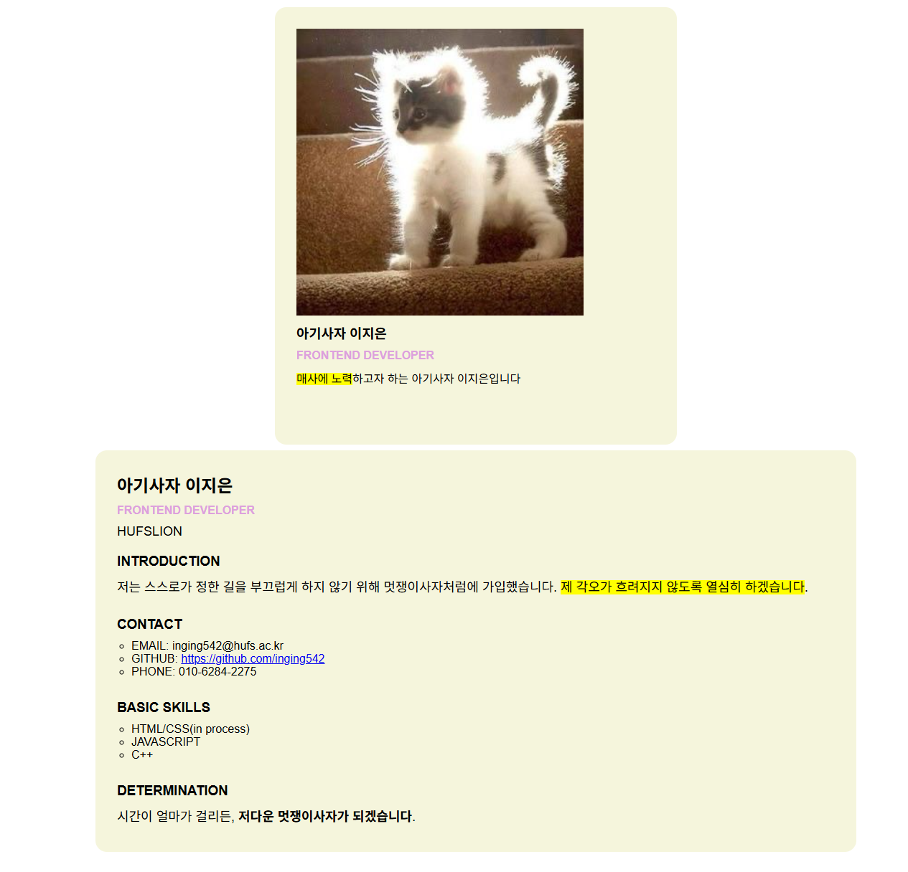

# 📘 Today I Learned

### 1. 오늘 배운 내용
기초 HTML+CSS/학습 날짜: 2026.04.03

### 2. 핵심 정리 (내 언어로)

  i. HTML과 CSS의 기초<br>
    1. 웹의 기본 구조<br>
      -HTML: 웹사이트의 구조를 정의해주는 뼈대로, 어떤 요소가 어떻게 들어갈 것인지 정의함<br>
      -CSS:글자 폰트, 크기 등등을 디자인해줌<br>
      -JavaScript: 정의된 요소들이 어떻게 구동될 것인지 기술함<br>
    2. HTML 기본 설명서<br>
      -<태그>~~~</태그><br>
        다양한 태그를 활용하여 웹사이트의 구조를 정의한다<br>
      -가장 많이 활용되는 태그 예시<br>
       <hn>(내용)</hn>: n의 크기가 커질수록 (내용)의 폰트 크기가 작아진다<br>
       div: 레이아웃을 만들거나 콘텐츠를 나눔<br>
       br: 줄넘김 태그<br>
       strong: 원하는 곳의 내용을 bold채로 바꾸어 주는 태그, 강조하고 싶은 내용에 주로 사용된다.<br>
   
  ii. 목록을 구현하는 태그 ul과 li<br>
  
    ```
    <ul>
      <li>love</li>
      <li>HUFS</li>
      <li>LION</li>
    </ul>
    ```
    ul태그를 통해 정렬되지 않은 목록(순서가 중요하지 않은 목록)을 나타내고, li태그를 통해 목록 안의 요소들을 나타내준다.
    이때 ul태그는 반드시 최소 하나 이상의 li태그를 자식으로 가져야 한다.
    이렇게 목록으로 나타낸 요소들은 'list-style-type'를 사용하여 다양한 스타일로 나타낼 수 있다.

  iii. 모든 행의 줄간격을 맞춰주는 방법<br>
  ```
  .box >* {
      margin: 0; /*기본 여백 초기화*/
      margin-bottom: 10px; /*문장 아래에만 여백 추가*/
  ```
  다양한 방법을 사용해봤지만 유일하게 적용된 방법이 기본 여백을 초기화하고 모든 줄 아래에 여백을 하나씩 추가하였다. 다만, 하나하나 일일이 추가해야하는 방법이라 비효율적일 수 밖에 없다.<br>
  추후 한 번에 한 container/box 안에 줄간격을 고정시킬 수 있는 방법을 알아볼 계획이다.
  

### 3. 결과 이미지(스크린샷)


### 4. 느낀 점
스스로 다양한 html 태그들과 css 요소들을 찾아 사용해보니 html에 많이 익숙해지고 친숙해질 수 있었다.<br>
또 내가 머릿속에서 그려본 페이지 양식을 직접 구현해보니, 너무나 신기했고 정말 많은 공부가 되었다.<br>
무엇보다 너무나 큰 재미를 붙일 수 있어서 뿌듯했다.
