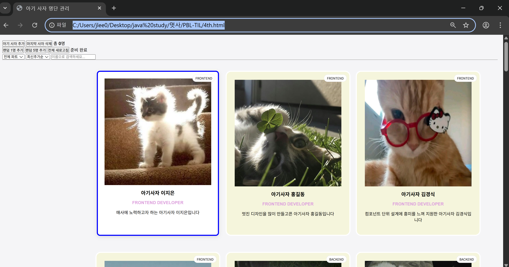
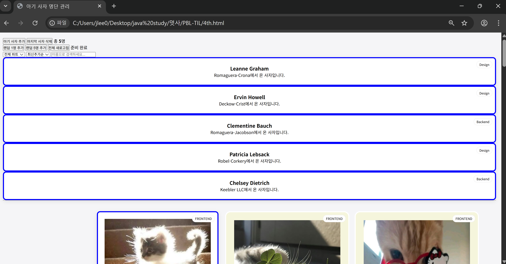
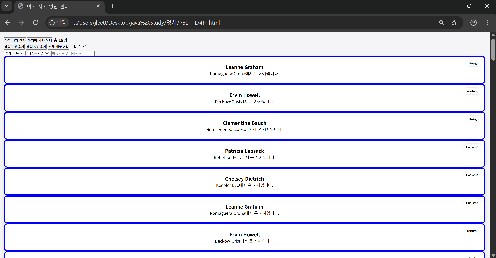
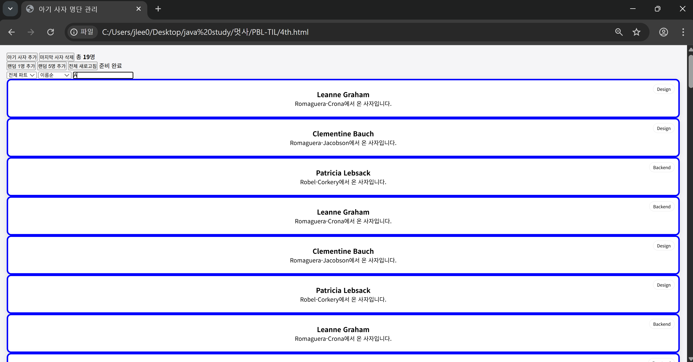
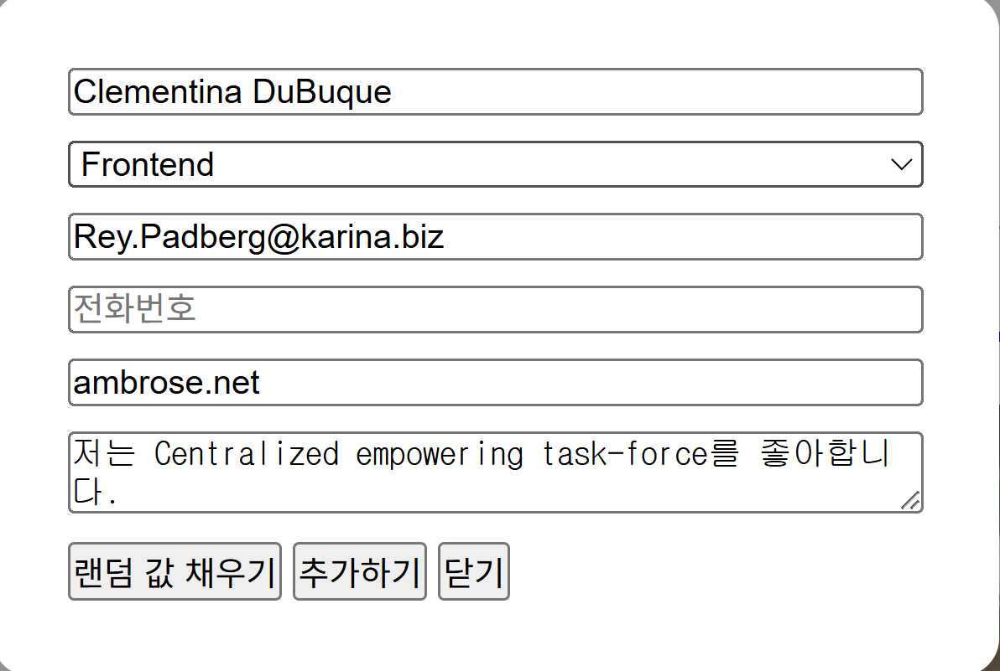

# 📘 Today I Learned

### 1. 오늘 배운 내용
-비동기 통신 (Async/Await): fetch API를 사용해 외부 서버(JSONPlaceholder)에서 데이터를 가져오고, 응답을 기다리는 동안 사용자에게 "불러오는 중..."이라는 메시지를 보여주는 UI 흐름을 배움 
-이떄 외부 서버 list에 맞춰서 카드 속 요소들의 제목을 name, part, intro로 지정 후 받음 
-btn-randon버튼을 통해 랜덤으로 사람 정보를 추가하는 기능을 구현 
-검색창을 통해 원하는 알파벳/글자가 포함된 사람을 찾을 수 있음 
### 2. 핵심 정리 (내 언어로)
-fetch API를 통해 외부 데이터를 가져오고, 이를 랜덤으로 받은 후 카드로 추가하였음
### 3. 결과 이미지(스크린샷)

### 4. 느낀 점
이번 활동은 특히나 어려웠다. javascript의 구현에서 아주 큰 어려움을 느꼈다. 그 중 총 인원수를 세는 과정에서 지속적으로 오류를 일으켜서 문제를 바로 잡는데 아주 큰 시간을 쏟았다. 아직도 만족스럽지 못하게 구현한 부분들이 많아서 추가적으로 복습 및 점검하는 시간을 가져야겠다고 생각했다. 
