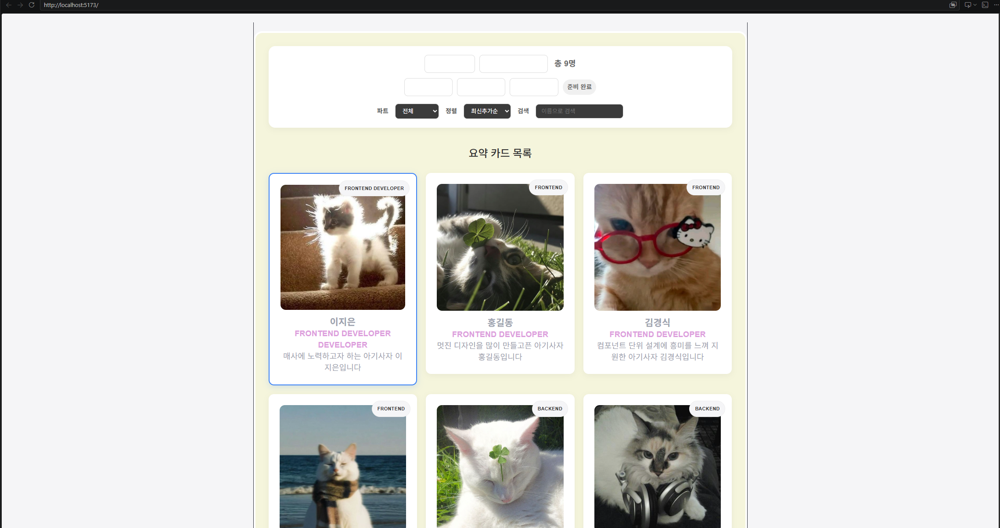
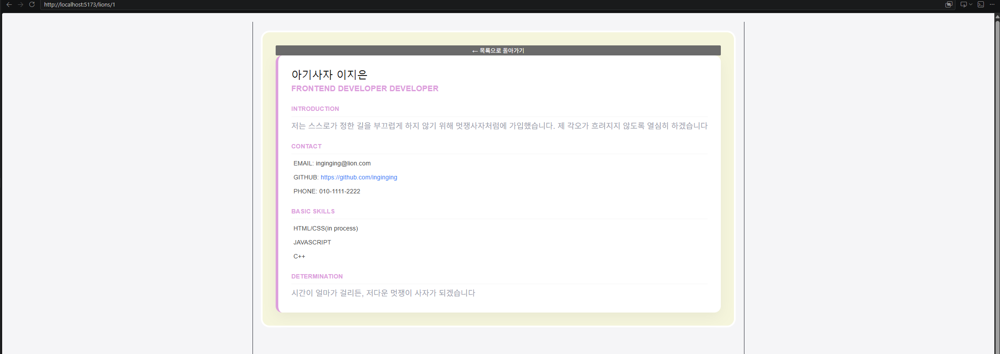
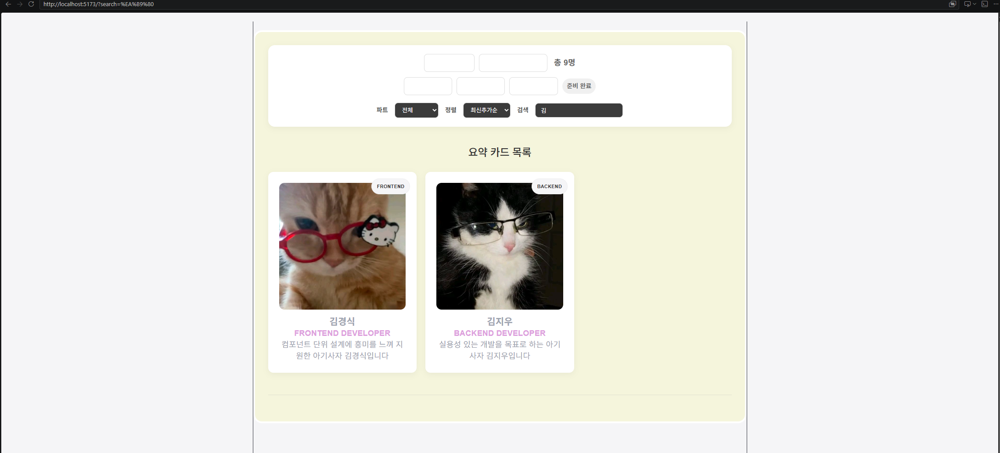
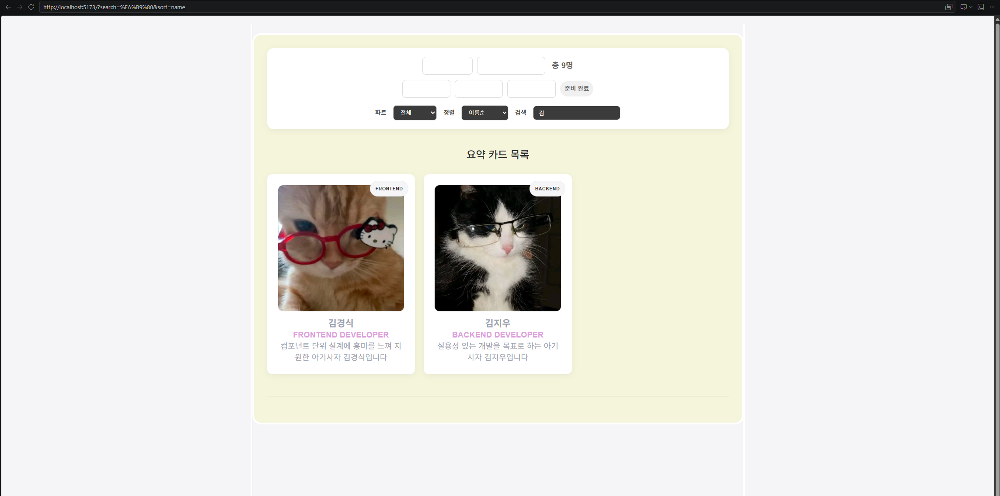
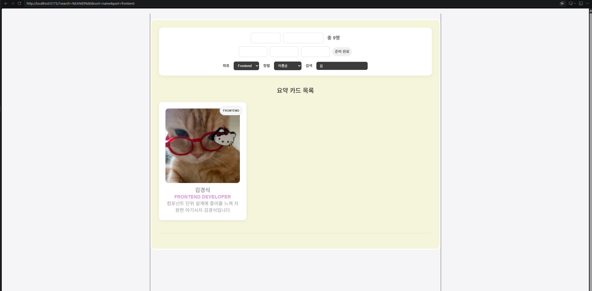
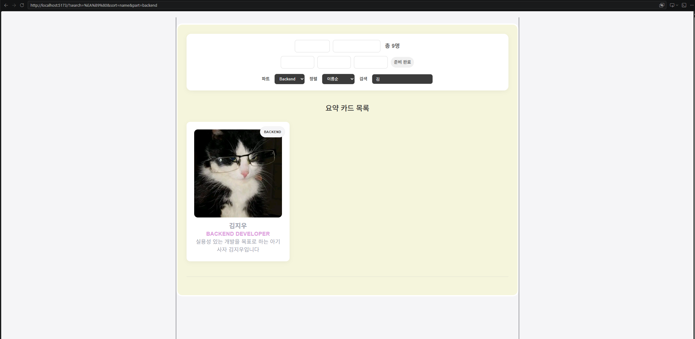

# 📘 Today I Learned

### 1. 오늘 배운 내용
  먼저 TypeScript를 적용하기 위한 기본적인 작업으로 .js/.jsx파일을 .ts/.tsx로 변경해야한다는 점과 데이터 구조에 interface로 타입을 정의해야한다는 점을 배웠다. 또 컴포넌트 props에 타입을 지정해야 한다는 점이 기반이 된다는 것을 배웠다.  
  다음으로 배운 점은 useState에 제너릭으로 타입을 명시한다는 점이다. 예를 들어 useState<Lion[]>처럼 작성해야한다.  
  또 이벤트 핸들러에도 적절하게 타입을 지정해줘야 함을 배웠다. 예를 들어 내 코의 ChangeEvent<HTMLInputElement> 등이 있다  
### 2. 핵심 정리 (내 언어로)
  TypeScript는 "이 변수에는 이런 모양의 값이 들어와야 해"라고 미리 약속해두는 것이다. 그러면 코드를 작성할 때 빨간 줄로 실수를 바로바로 알려주니까 버그가 줄어든다.
### 3. 결과 이미지(스크린샷)

### 4. 느낀 점
  처음에는 빨간 줄이 너무 많이 떠서 막막했지만, 하나하나 타입을 지정하다 보니까 점점 코드가 명확해지는 느낌이 들었다. 특히 mapApiToLion 함수에 : Lion 반환 타입을 붙이는 순간, 이 함수가 정확히 어떤 데이터를 반환하는지 한눈에 보여서 좋았다.
