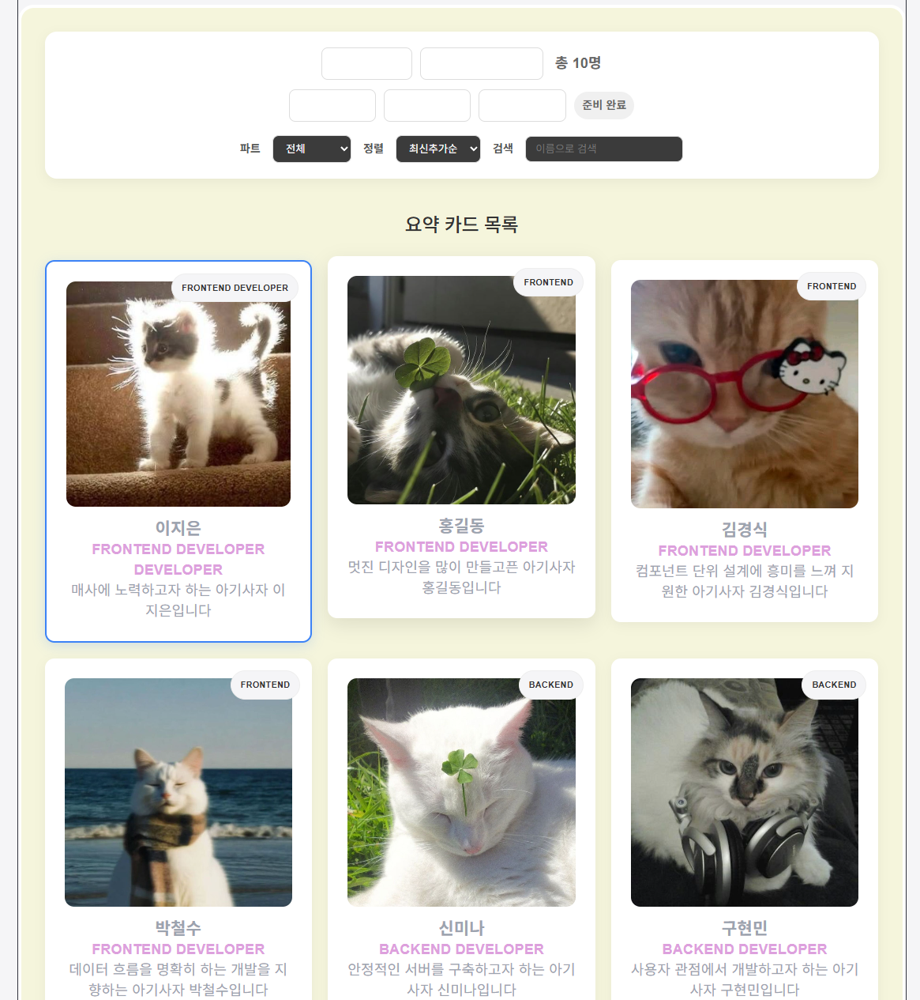

# 📘 Today I Learned

### 1. 오늘 배운 내용
  상태 관리 및 UI 예외 처리를 위해 데이터 로딩 중 버튼을 비활성화(disabled={isLoading}) 처리하고, 비동기 통신 상태(성공, 실패, 로딩 중)를 실시간 렌더링하도록 구현할 수 있었다.  
  수동 명단 추가 폼은 Portal 레이아웃을 응용한 팝업 형태의 아기사자 수동 등록 모달 창을 구현하도록 하였고, 9개 입력 필드의 공백 여부를 실시간으로 감지하여 제출 버튼 활성화를 제어하는 유효성 검사(isFormValid) 로직 추가였다. 
  외부 API 데이터 자동 완성을 위해 randomuser.me API를 연동하여 모달 내에서 버튼 클릭 한 번으로 이름, 이메일, 기술 스택, 자기소개 등 9개 입력 폼을 자동으로 완성해 주는 랜덤 값 채우기 기능을 구현하였다.
### 2. 핵심 정리 (내 언어로)
  리액트로 아기사자 명단을 다루면서 생긴 경로 오류와 코드 꼬임 문제를 해결하고, 실시간 검색·필터링 기능과 랜덤 정보 자동 완성 모달창까지 구현할 수 있었다.
### 3. 결과 이미지(스크린샷)

### 4. 느낀 점
  API를 연동하여 랜덤값을 받아내는 구현을 시행하므로써 그 시스템을 깊이 이해할 수 있었다. 또 여러 상태(필터, 정렬, 검색어 등)가 조합되어 최종 화면이 결정되는 흐름을, 데이터가 어디서 시작해 어디까지 흘러가는지를 아직 완벽하지 않지만, 조금이나마 깊이 이해할 수 있었다. 
